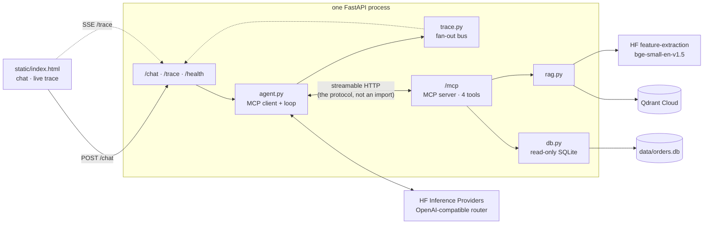

# support-copilot-api

An e-commerce support copilot for a fictional Indian store, **DesiCart**. It answers
questions grounded in store data — policy documents and an order database — and exposes
those lookups as an [MCP](https://modelcontextprotocol.io) server.

The point of the project is the **glass box**: the web UI puts the conversation on the left
and the live MCP protocol trace on the right, so you watch the agent discover tools, decide
what to call, and get results back, in real time. Nothing is faked for the demo — the agent
reaches the tools over HTTP, exactly as an external MCP client would.

It runs in 512MB of RAM on free tiers throughout. No `torch`, no `sentence-transformers`,
no `transformers`, no `pandas` in the container.

---

## Architecture



The dashed protocol edge is the load-bearing one. `agent.py` never imports `rag.py`,
`db.py` or `mcp_tools.py` — [a test enforces
this](tests/test_agent_loop.py) by parsing the module's imports. If the agent could reach
the tools directly, the trace pane would be theatre.

### Request path

0. `POST /chat` takes `{"message": str, "history": [{"role", "content"}]}`. **The client
   holds the conversation, not the server** — there is no session store to evict and
   nothing is lost when the container restarts. `role` is restricted to `user` and
   `assistant` by the schema, so a browser cannot forge a `system` instruction or a `tool`
   result, and the history is trimmed to `MAX_HISTORY_TURNS` before it reaches the model.
1. The agent opens (or reuses) one long-lived MCP `ClientSession`.
2. `tools/list` → MCP schemas are converted to OpenAI tool-calling format.
3. The LLM is called with `tool_choice="auto"`; every tool call it returns is executed
   through the MCP client and appended as a `role: "tool"` message.
4. Repeat until the model stops asking for tools, or `MAX_TOOL_ROUNDS` is spent — after
   which one final call is made **with tools withheld**, forcing an answer.
5. Every boundary crossed emits a trace event, fanned out to all connected viewers.

The MCP session is opened **lazily on the first request**, not in the FastAPI lifespan.
The server it dials is this same process, which is not yet accepting connections during
startup — connecting there would deadlock.

### Tools

| Tool | Purpose |
|---|---|
| `search_policies(query, top_k=5)` | Semantic search over the policy corpus. Returns chunks with `doc`, `section`, `anchor`, `score`, `text`. |
| `order_status(order_id)` | One order: status, full timeline, value, payment method, line items. Returns `found: false` rather than raising. |
| `orders_summary(days=30, status=None)` | Aggregate counts and value over a window. |
| `check_delivery(pincode)` | Serviceability, zone, delivery estimate, COD availability. Unknown pincodes return a clearly-labelled regional inference, never a confident guess. |

All SQL is parameterized and the database is opened read-only (`file:...?mode=ro`).
Statuses are checked against a whitelist before they reach a query.

---

## Local setup

You need **two** Python environments. The container-side app must stay light, so the heavy
indexing dependencies live outside it.

### 1. Generate the corpus

```bash
python scripts/make_corpus.py
```

Writes 13 internally-consistent policy documents to `data/docs/` and a 200-order SQLite
database to `data/orders.db`. Every fact in the documents is generated from a constants
block at the top of the script, so the corpus cannot contradict itself.

Some plausible topics are **deliberately undocumented** — international shipping,
subscriptions, B2B bulk orders, corporate gifting, price matching. They exist so
"the documentation doesn't cover this" is a real, testable case.

#### Shelf life: regenerate every few weeks

Order dates are anchored to `date.today()` **at generation time** and spread over the
preceding 90 days. The database is then baked into the container image, so it starts
ageing the moment it is built.

Nothing breaks and nothing is invented — the agent keeps reporting exactly what the
database says. But the store it describes stops looking like a live one:

| After about | What goes wrong |
|---|---|
| 1 week | Order 4412 falls outside its 7-day return window, so the demo walkthrough answers "the window has passed" |
| 2 weeks | The 45 `placed` / `packed` / `in_transit` orders turn implausible — nothing stays in transit for a fortnight |
| 1 month | `orders_summary(days=30)` returns **zero orders**, because the newest order predates the window |
| 3 months | Every order is outside the default reporting window entirely |

To refresh, from the repo root:

```bash
python scripts/make_corpus.py      # re-anchors all 200 orders to today
git push                           # Railway rebuilds; or: docker build -t support-copilot .
```

The seed is fixed, so you get the *same* 200 orders with the same IDs and the same
contents — only the dates move. Order 4412 stays a recently-delivered order, so the demo
question keeps working.

You do **not** need to re-run `index_docs.py` afterwards. The policy documents only change
if you edit the constants block, and the vectors in Qdrant describe those documents, not
the orders.

`make_corpus.py` is stdlib-only and runs in well under a second, so if manual refreshes
become tedious it can be moved into the container's startup command — then every boot
re-anchors the data by itself.

### 2. Index into Qdrant

```bash
pip install -r requirements-dev.txt        # torch, sentence-transformers, qdrant-client
cp .env.example .env                       # fill in QDRANT_URL and QDRANT_API_KEY
python scripts/index_docs.py
```

Chunks by `##` section, splitting anything over ~400 tokens with 15% overlap. Embeds
locally with `BAAI/bge-small-en-v1.5` and upserts with deterministic point IDs, so
re-running replaces rather than duplicates. Expect `points=73 dim=384`.

`--dry-run` chunks and prints the plan without loading a model or touching the network.

### 3. Run the app

```bash
python -m venv .venv
.venv/bin/pip install -r requirements.txt  # Windows: .venv\Scripts\pip
.venv/bin/uvicorn app.main:app --reload
```

Open <http://127.0.0.1:8000>.

### Verify

```bash
python scripts/mcp_probe.py            # protocol-level smoke suite, incl. injection cases
python scripts/mcp_probe.py --schemas  # the tool schemas the model actually sees
curl http://127.0.0.1:8000/health      # per-dependency status
pytest                                 # 82 tests, ~5s
```

`mcp_probe.py` speaks the protocol over the wire; it never imports the tool code.

---

## Deploying to Railway

The repo is a single container. Nothing else needs deploying — Qdrant and the models are
managed elsewhere.

1. **Push to GitHub**, then in Railway: *New Project → Deploy from GitHub repo*. The
   `Dockerfile` is detected automatically.
2. **Set variables** (*Variables* tab). At minimum:

   ```
   HF_TOKEN=hf_...
   QDRANT_URL=https://....cloud.qdrant.io:6333
   QDRANT_API_KEY=...
   ```

   Leave `MCP_SERVER_URL` **unset** — the Dockerfile derives it from Railway's injected
   `$PORT`. Setting it by hand to a fixed port is the most likely way to break the deploy.
3. **Generate a domain** (*Settings → Networking → Generate Domain*).
4. Check `https://<your-domain>/health`. It should report `status: ok` with all three
   dependencies green.

`data/orders.db` is baked into the image. It is read-only at runtime, so no volume is
needed; to change the data, regenerate it and redeploy.

### Any other container host

Fly.io, Render and Cloud Run work the same way. The only requirements are that `$PORT` is
respected (it is) and that the process can reach itself on `127.0.0.1` (needed for the MCP
client). Scale-to-zero platforms are fine; scaling to *multiple* instances is not tested —
the rate limiter is per-process and in memory.

---

## Connecting as an MCP connector

The `/mcp` endpoint is a standard MCP server over streamable HTTP. Any MCP client can use
it, not just the built-in UI.

**claude.ai** (Pro/Max/Team/Enterprise) → *Settings → Connectors → Add custom connector* →
URL:

```
https://<your-domain>/mcp/
```

**Claude Desktop** → *Settings → Connectors → Add custom connector*, same URL.

**Claude Code**:

```bash
claude mcp add --transport http desicart https://<your-domain>/mcp/
```

Keep the trailing slash. Without it the request 307-redirects; most clients follow that,
but you pay an extra round trip on every call.

The server needs no authentication, which is fine for a read-only demo over synthetic data.
Add an auth layer before pointing anything like this at real records.

---

## Free-tier notes

**Cold starts.** A scaled-to-zero container takes a few seconds to accept the first
request, and the first LLM call can add 10–30s while the provider loads the model. The UI
says so up front and shows a live elapsed timer. The first `search_policies` may also
return a 503 while the embedding model warms — the tool surfaces that as a readable error
rather than a traceback.

**Rate limits.** Per-IP hourly and global daily caps, both rolling windows held in memory
(`PER_IP_HOURLY_CAP`, `DAILY_MESSAGE_CAP`). They protect the HF token, not the server. They
reset on restart, and the `/trace` stream is never rate limited — a blocked viewer can still
watch. Hugging Face applies its own quota on top; a 429 from the router surfaces as a chat
error.

**Memory.** The container holds FastAPI, the MCP server and client, and httpx. Embeddings
are computed remotely and Qdrant is reached over REST specifically to avoid pulling
`qdrant-client` (and with it grpcio and protobuf) into the image.

**Qdrant free tier** is 1GB — this corpus uses 73 points of 384 dimensions, which is
nothing. Clusters do get paused after prolonged inactivity; `/health` will show it.

---

## Configuration

Every variable is documented in [.env.example](.env.example). `app/config.py` validates
them at startup and exits listing everything that is missing, rather than failing on the
first request.

Only `HF_TOKEN` and `QDRANT_URL` are required. Swapping LLM provider is `LLM_BASE_URL` plus
`LLM_MODEL` — no code change. The model must support tool calling.

`app/rag.py` asserts at startup that the runtime embedding dimension matches the Qdrant
collection's. A genuine mismatch is fatal; a transient outage only logs a warning, so a
cold provider cannot stop the app from booting.

---

## Project layout

```
app/
  main.py         FastAPI app; mounts /mcp, /chat, /trace, /health, static
  config.py       env loading + validation, fails fast
  mcp_tools.py    MCP server: the four tool definitions
  rag.py          embed query -> Qdrant search
  db.py           read-only SQLite queries
  agent.py        MCP client session + agent loop
  trace.py        emit() + SSE fan-out bus
  inference.py    LLM calls via the HF router
static/index.html two-pane UI, single file, no build step
scripts/          corpus generation, indexing, MCP probe (laptop only)
evals/            offline evaluation: dataset, runner, run history
tests/            pytest suite
```

---

## Evaluation

`pytest` proves the code is correct. It cannot tell you whether the *answers* are good —
an answer can cite a real section that does not actually support the claim while every
test stays green. That is what the evals measure.

```bash
.venv/bin/python evals/run_evals.py --url http://127.0.0.1:8000
```

The runner is an ordinary MCP + HTTP client. It imports nothing from `app/`:

- **Retrieval** is measured by calling `search_policies` through the public `/mcp`
  endpoint, so recall reflects the retriever rather than the agent's judgement.
- **Tool selection** is read off the live `/trace` stream and correlated by request id.
- **Evidence** for the judge is reconstructed by replaying the exact tool calls the agent
  made, so the judge sees precisely the facts the agent had — no more, no less.
- **Groundedness** is scored by an LLM judge at temperature 0, with the judge model
  recorded in every output file. Set `JUDGE_MODEL` to change it.

`evals/dataset.jsonl` holds 34 cases: policy lookups with expected chunk IDs, order and
delivery questions with expected tools, and five deliberately-undocumented topics where
the only correct answer is a refusal.

Each run writes a timestamped JSON to `evals/history/` and rewrites the table below.
A `--limit` run does not touch the README, so a small sample cannot overwrite a full one.

> **Rate limits.** The dataset is larger than the default per-IP hourly cap, so a run
> against a live instance will be cut short. Raise `PER_IP_HOURLY_CAP` on the target first,
> or pass `--limit`. The runner stops with a clear message rather than reporting numbers
> from a truncated run.

<!-- EVAL_RESULTS_START -->

_Last run 2026-07-28 06:56 UTC against `http://127.0.0.1:8000`._

Answers: `Qwen/Qwen2.5-72B-Instruct` · Judge: `Qwen/Qwen2.5-72B-Instruct` at temperature 0.0 · 7 of 34 cases completed.

| Metric | Value | Better | What it measures |
|---|---|---|---|
| Retrieval recall@5 | 97% | higher | Fraction of expected chunks in the top 5 |
| Retrieval hit rate@5 | 97% | higher | At least one expected chunk retrieved |
| Correct-tool rate | 100% | higher | Expected tool actually called |
| Groundedness | 99.7% | higher | Supported claims / all claims, judged |
| Hallucination rate | 0.02% | lower | Answers with an unsupported or invented claim |
| Refusal accuracy | 100% | higher | Undocumented topics correctly declined |
| False-refusal rate | 0% | lower | Answerable questions wrongly declined |
| Average rounds | 2.00 | - | Tool-calling rounds per answer |
| Average latency | 26.0s | - | Seconds per answer, end to end |

Full history in [`evals/history/`](evals/history/). Re-run with `python evals/run_evals.py --url <target>`.

<!-- EVAL_RESULTS_END -->
